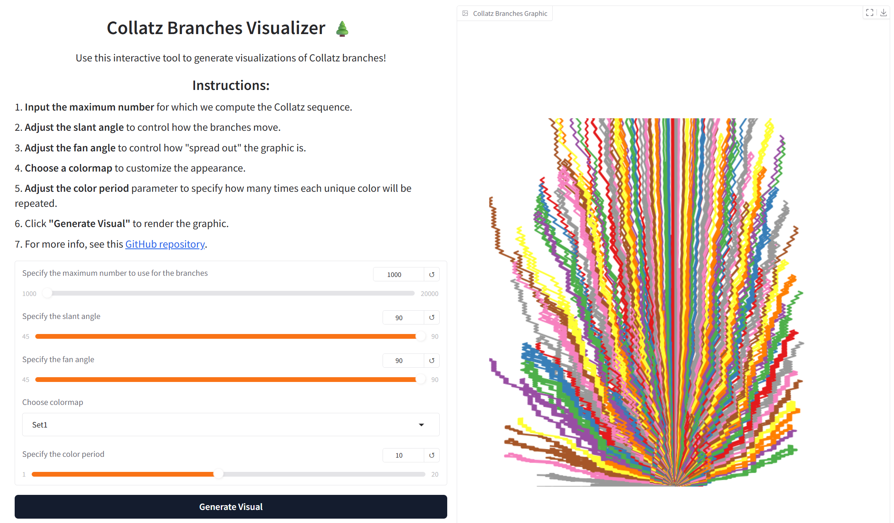

# Collatz Branches Visualizer using Gradio
This is a Gradio app that visualizes the branches made by number paths when subjected to the Collatz rule. Given a natural number `n`, the Collatz rule returns `n/2` if `n` is even and `3n + 1` if `n` is odd.

Accessing the App
=================

To access this app, you can either

1. Clone the repository. Then, run 

`pip install -r requirements.txt`

on the terminal. It is ideal to create a virtual environment first before proceeding to the installation of the required libraries. Once done, you can then run

`python app\app.py`

on the terminal and use the app on your local server.

OR

Install Docker on your device and run 

`docker build -t collatz_img:final .`

Once the image has been built, run

`docker run -p 7860:7860 collatz_img:final .`

OR

Access the app via HuggingFace Spaces through this <a href="https://huggingface.co/spaces/arnel8888/collatz-branches-visualizer" target="_blank">link</a>.

2. Once you have access to the app, you can then use it to create visualizations of Collatz branches. Adjust the parameters as needed. 